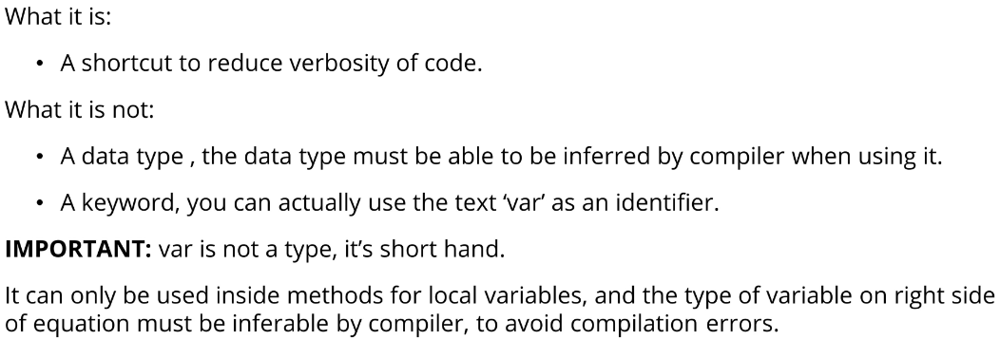
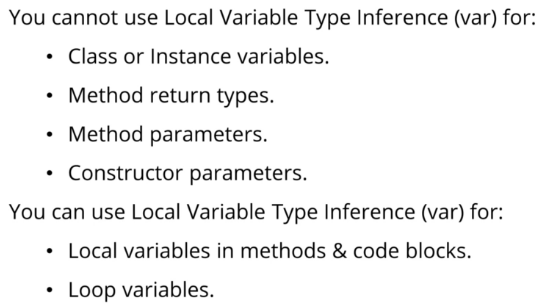
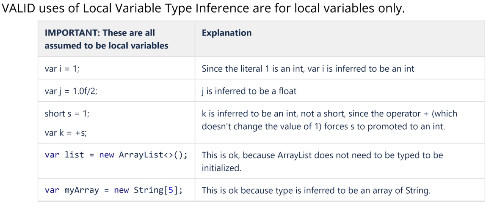
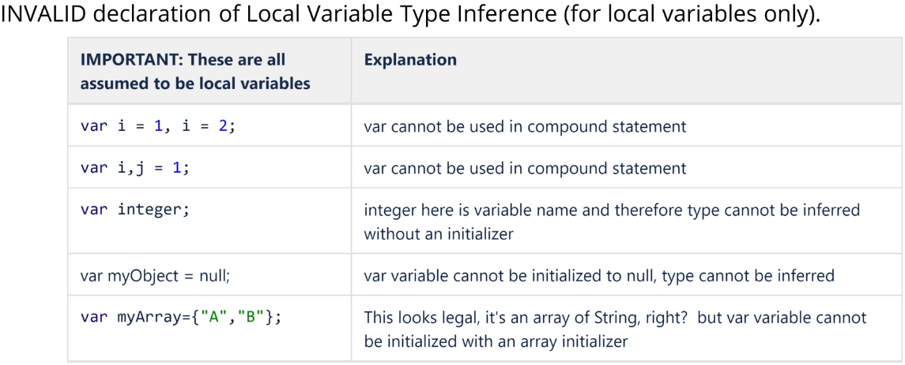

## Local Variable Type Inference



Note:
It is ok to assign a null object to LVTI variable but not literal null

Below code compiles fine
````
Object nullObject = null;
var var = nullObject;
````

Below code gives compile error
````
var var = null;
````
### Invalid Var Declarations

// cannot use var declaration in a compound statement
````
var j = 0, k = 0;
````

// again, cannot use var declaration in a compound statement
````
var m, n = 0;
````

// An array can be assigned to an LVTI variable
````
var aVarArray = new int[3];
````

// Cannot declare a var variable without also initializing it
````
var someObject;
````

// Cannot assign null to var variable, type cannot be inferred
````
var newvar = null;
```` 

// Cannot use array initializer in var declaration/initialization
````
var myArray = {"A", "B"};
````

// Cannot have an array of var
````
var[]newarray = new int[2]; 
````
// Invalid, cannot have a method return type of var
````
public static var returnThis(String[] args) {
    return args;
}
````

// Invalid, cannot have method parameter of var
````
public static String[] returnThat(var args) {
    return args;
}
````

// Static class variables cannot be declared with var
````
public class VarDonts {
    static var classVariable = 10;
}
````

// class instance variables cannot be declared with var
````
public class VarDonts {
    var instanceVariable = 20;

    public static void main(String[] args) {
    }
}
````

### Usage





